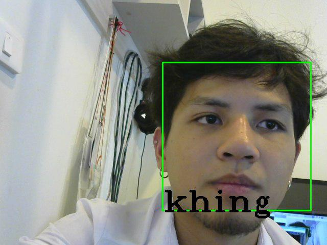

# What is FEWWW
Fewww คือ ระบบแจ้งเตือน โดยใช้ระบบ Face-Detection เข้ามาช่วยเหลือในการตรวจจับหน้าบุคคล และการเอา Chat Service มาเป็นตัแจ้งเตือนและควบคุมการทำงาน (Bot) โดยจุดประสงค์คือการแจ้งเตือนเมื่อเครื่องมือ detect ใบน้าของบุคคลให้เจ้าของบ้านรับรู้และตอบสนองได้ท่วงทันเหตุการณ์

# Component
สิ่งที่เราใช้มาประกอบการทำ Project Fewww ก็มีดังนี้ <br>
* [Rasberry Pi 3 Model B]()
* Computer Webcam (ทางเราใช้ [Logitech HD WEBCAM C310](https://www.logitech.com/en-us/product/hd-webcam-c310?crid=34))

ส่วนทางด้าน ภาษา
* C++ (OpenCV)
* Javascript (node-telegram-bot-api)
* Python

# How did it work?
Fewww จะทำงานอยู่บน Raspberry-Pi โดย System ของเรานั้นจะแบ่งเป็น 2 ส่วนหลังนั้นก็คือ ส่วนของการ `Detection` และ `Notifiation` ซึงส่วนของการ `Detection` นั้นจะคอย ตรวจจับใบหน้าและจะเป็นส่วนที่จะ Trigger ให้ `Notifiation` ทำงานคือ การ Notify ผู้ใช้

## OpenCV C++


### ตัวอย่าง Code ของ Face Detection

ในส่วนของ Detection 
```c++
        for(size_t i=0;i<faces.size();i++){

            //point begin and end of faces
            Point f_begin(faces[i].x, faces[i].y);
            Point f_end(faces[i].x + faces[i].width , faces[i].y + faces[i].height);

            Rect crop = Rect(faces[i].x, faces[i].y, faces[i].width, faces[i].height);
            Mat cropimage = gray(crop);


            num++;
            sprintf(path, "user/user3.%d.jpg", num);
            imwrite(path, cropimage);

            waitKey(1);

            //draw rectangular
            rectangle(frame, f_begin, f_end, Scalar(0, 255, 0), 2);
        }
        imshow("face", frame);

```
### ตัวอย่าง รูปของการ Detect


## Telegram bot api


ในส่วนของการ Notify User นั้นอย่างที่เราได้กล่าวไว้ในข้างต้นว่าเราใช้ตัว Telegram Bot เป็นตัวส่งให้ User รับรู้ โดยภาษาที่ใช้สั่งตัว Telegram Bot ที่เราใช้คือ JavaScript (node.js) และใช้ [node-telegram-bot-api](https://github.com/yagop/node-telegram-bot-api) โดยเราจะแบ่งตัว Program เป็น 2 ส่วนคือ ส่วนที่ Run ตลอดเพื่อรอรับคำส่งจาก User แและอีกส่วนนึงก็เป็นตัที่รอการโดย Trigger จาก C++ เมื่อมีการ detect เกิดขึ้น

### ตัวอย่าง Code ของการส่งรูปไปยัง User
```js
const TelegramBot = require('node-telegram-bot-api');
const token = '<botToken>';
const bot = new TelegramBot(token, {polling: true});

setTimeout(function() {
    bot.sendPhoto(msg.chat.id,"test_picture.jpg")
    .then(() => {
        console.log('--sending completed--');
        console.log('--sended to '+msg.chat.username+'--');
    })
    .catch(() => {
        console.log('-- sending err --');
    });
    }, 5000);

```

# Interface
ในส่วนของการใช้งานนั้น การทำงาน Few จะทำงานโดยผ่านการควบคุมของ `Feww Alert bot` ซึ่งคำส่งการทำงานขึ้นให้เรียบร้อยบน Keyboard


|command| action|
| :-: | :-: |
|/start|เริ่มเปิดระบบ Detection|
|/sendpic|การส่งรูป|

### รูปตัวอย่างของ Interface


# Team Member

|<a href=""></a>  |<a href=""></a>  |<a href=""></a>  |
| :-: | :-: | :-: |
|พชรพล พรหมมา|รฐนนท์ จันทนะสุคนธ์|รวิชญ์ โลหะขจรพันธ์|
|60070058 |      60070079      |      60070081      |
|    @    |     @ khingbmc     |     @RawitSHIE     |

# Instructor
|<a href=""></a>  |<a href=""></a>  |
| :-: | :-: |
|ผศ. ดร. กิติ์สุชาติ พสุภา|ผศ. ดร. ปานวิทย์ ธุวะนุติ|

# Reference
 [OpenCV C++](https://github.com/yagop/node-telegram-bot-api)

 [node.js telegram bot api](https://github.com/yagop/node-telegram-bot-api)

[Telegram bot api Document](https://github.com/yagop/node-telegram-bot-api)

